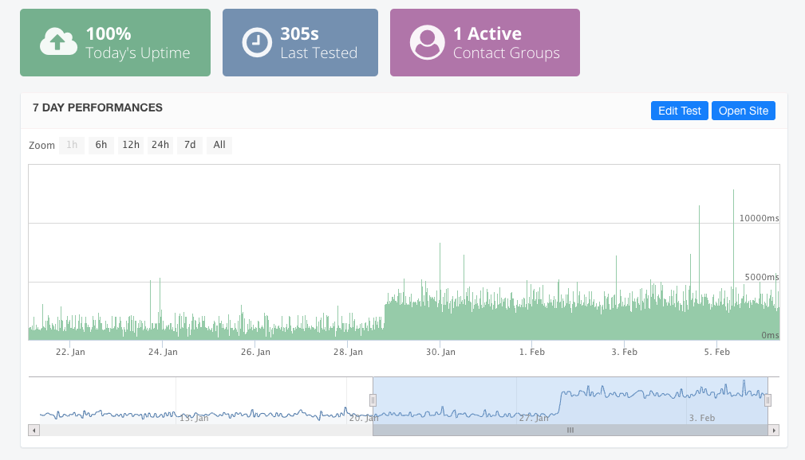

// .subtitle
// Use of the AsciiDoc automatic subtitle partitionning.
// :include: //div[@class="slides"]
// :header_footer:
= Der ÖREB-Kataster: Eine Ode an offene Standards und Software
:customcss: my-css.css
:author_name: Stefan Ziegler / Amt für Geoinformation Kanton Solothurn
:author: {author_name}

== Slide One

* Foo
* Bar
* World

== Slide Two

A Great Story

[.notes]
--
* tell anecdote
* make a point
--

== Fubar

 

== Slide Five

Uses highlighted code

[source, java]
----
System.out.println("Hello World")
----
